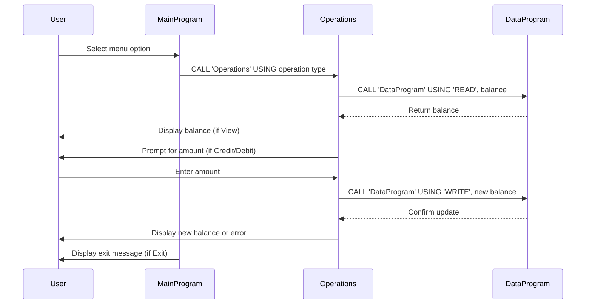

# COBOL Student Account Management Documentation

This project contains COBOL programs for managing student accounts, including viewing balances, crediting, and debiting accounts. Below is an overview of each file, key functions, and business rules.

## File Overview

### src/cobol/main.cob
**Purpose:**
- Entry point for the Account Management System.
- Handles user interaction and menu navigation.

**Key Functions:**
- Displays menu options: View Balance, Credit Account, Debit Account, Exit.
- Accepts user input and calls the Operations module based on the selected action.

**Business Rules:**
- Only allows choices 1-4; displays an error for invalid input.
- Exits gracefully when the user selects Exit.

### src/cobol/operations.cob
**Purpose:**
- Implements account operations: viewing balance, crediting, and debiting.

**Key Functions:**
- Receives operation type from main.cob.
- Calls DataProgram to read/write balance.
- Handles credit and debit transactions.

**Business Rules:**
- For debit operations, checks if sufficient funds are available before debiting.
- Displays appropriate messages for successful transactions or insufficient funds.

### src/cobol/data.cob
**Purpose:**
- Manages persistent storage of the account balance.

**Key Functions:**
- Reads the current balance (READ operation).
- Updates the balance (WRITE operation).

**Business Rules:**
- Initializes balance to 1000.00.
- Ensures balance is updated only through valid operations.

---

## Business Rules Summary
- Initial balance is set to 1000.00.
- Debit operations are only allowed if the balance is sufficient.
- All operations are performed through structured COBOL modules for clarity and maintainability.

---

For further details, see the source code in the `src/cobol/` directory.

---

## Sequence Diagram: Data Flow

